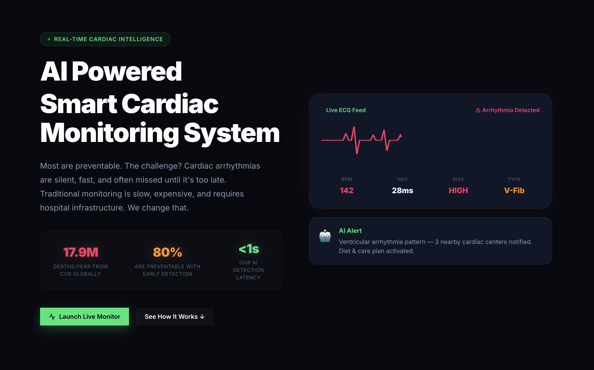
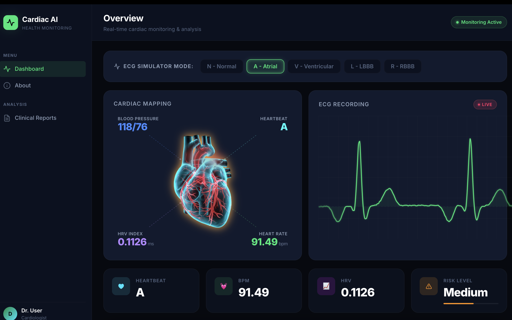
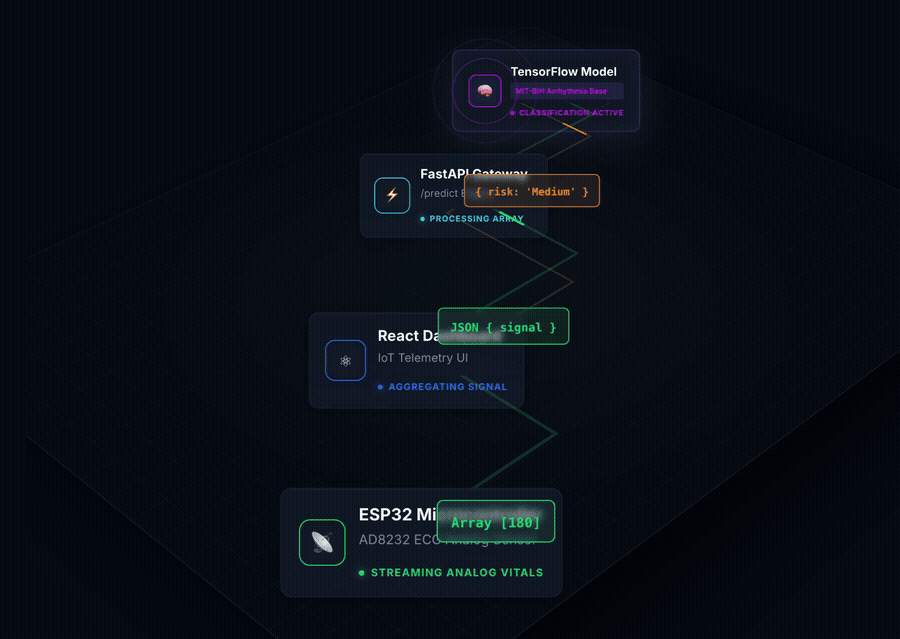

# CardioAI — AI-Based Smart Cardiac Monitoring System

> **Real-time ECG arrhythmia detection powered by a 1D-CNN deep learning model, served through a FastAPI backend and visualized through a modern React dashboard.**

---

##  Project Overview

**CardioAI** is a full-stack, AI-powered cardiac monitoring platform designed to detect heart arrhythmias in real time. The system simulates IoT-style ECG data streams, classifies heartbeats using a trained deep learning model, assesses patient risk levels, and presents clinical insights through an interactive web dashboard.

The platform is built around three core pillars:

| Pillar | Description |
|---|---|
| 🧠 **AI/ML Engine** | 1D Convolutional Neural Network trained on the MIT-BIH Arrhythmia Dataset |
| ⚙️ **Backend API** | FastAPI REST service loading the trained model from Hugging Face Hub |
| 🖥️ **Frontend Dashboard** | React + Vite SPA with live ECG visualization, metrics, and clinical action hub |

---

### 🏠 Landing Page


> Real-time cardiac intelligence showcase — live ECG feed, AI alert panel, and key statistics.

---

### 📊 Live Monitoring Dashboard


> Interactive dashboard showing real-time ECG waveform (D3.js), animated 3D heart, and live BPM / HRV / Risk metrics with the ECG Simulator Mode selector.

---

### 🔄 Flow Of Work



> This animation illustrates the end-to-end system workflow — how data moves through each layer of the architecture:
> - ECG signal originates from the IoT/Simulator layer
> - Signal is sent to the FastAPI backend via HTTP POST
> - Backend loads the trained 1D-CNN model from Hugging Face Hub
> - Model classifies the beat → risk level is assessed
> - Results are returned to the React frontend for visualization

---

## 🗂️ Project Structure

```
final_proj/
│
├── backend/                        # FastAPI inference server
│   ├── app/
│   │   ├── main.py                 # FastAPI app entry point (CORS, router)
│   │   ├── router/
│   │   │   └── predict_router.py   # POST /predict endpoint
│   │   └── schemas/
│   │       └── ecg_schema.py       # Pydantic input schema (ECGSignal)
│   ├── src/
│   │   └── inference/
│   │       ├── predict.py          # Model loading (HuggingFace) + prediction
│   │       ├── risk_analysis.py    # Heartbeat → Risk level mapping
│   │       └── heart_metrics.py    # BPM & HRV calculation utilities
│   ├── run.py                      # Uvicorn server launcher
│   └── requirements.txt
│
├── training_model/                 # ML training pipeline
│   ├── src/
│   │   ├── data/
│   │   │   ├── load_data.py        # WFDB record loader (MIT-BIH)
│   │   │   ├── create_dataset.py   # Beat segmentation (180-sample windows)
│   │   │   └── preprocess.py       # Signal preprocessing utilities
│   │   ├── training/
│   │   │   ├── train_model.py      # Full CNN training pipeline
│   │   │   └── evaluate_model.py   # Model evaluation utilities
│   │   └── simulation/
│   │       └── ecg_stream.py       # Offline ECG stream simulator (CLI)
│   ├── data/
│   │   ├── raw/mit-bih/            # Raw MIT-BIH .dat + .hea + .atr files
│   │   └── processed/              # Processed/saved numpy arrays
│   └── models/
│       ├── cardiac_model.keras         # Final saved model
│       ├── best_cardiac_model.keras    # Best checkpoint (lowest val_loss)
│       └── label_encoder.pkl           # Scikit-learn LabelEncoder
│
└── frontend/                       # React + Vite dashboard
    ├── src/
    │   ├── App.jsx                 # Router setup (React Router v6)
    │   ├── index.css               # Global design system & component styles
    │   ├── pages/
    │   │   ├── Home.jsx            # Landing page with IoT pipeline visualization
    │   │   ├── Dashboard.jsx       # Live cardiac monitoring dashboard
    │   │   ├── Reports.jsx         # Session-based cardiac report viewer
    │   │   ├── Recommendations.jsx # AI clinical recommendations (risk-gated)
    │   │   ├── Hospitals.jsx       # Nearby emergency hospital finder
    │   │   ├── Diet.jsx            # Heart-healthy cardiac diet plans
    │   │   ├── Yoga.jsx            # Safe cardiac exercise & yoga guides
    │   │   └── About.jsx           # Project info & tech stack page
    │   └── components/
    │       ├── D3ECGWaveform.jsx        # Live D3.js ECG waveform renderer
    │       ├── HeartVisualization.jsx   # Animated 3D-style heart component
    │       ├── MetricsPanel.jsx         # BPM / HRV / Risk metric cards
    │       ├── Navbar.jsx               # Sidebar navigation
    │       ├── PipelineVisualization.jsx# Isometric IoT→AI pipeline diagram
    │       ├── ECGChart.jsx             # Chart.js ECG plot component
    │       ├── HospitalPanel.jsx        # Hospital card component
    │       └── RecommendationPanel.jsx  # Clinical recommendation card
    ├── package.json
    └── vite.config.js
```

---

## 🧠 Machine Learning Model

### Algorithm: **1D Convolutional Neural Network (1D-CNN)**

The model is a custom sequential 1D-CNN purpose-built for single-lead ECG beat classification.

#### Architecture

```
Input: (180, 1)  — 180-sample ECG beat window, 1 channel
│
├── Conv1D(32, kernel=5, padding='same', activation='relu')
├── BatchNormalization()
│
├── Conv1D(64, kernel=5, padding='same', activation='relu')
├── BatchNormalization()
├── MaxPooling1D(pool_size=2)
├── Dropout(0.3)
│
├── Conv1D(128, kernel=3, padding='same', activation='relu')
├── GlobalAveragePooling1D()
│
├── Dense(128, activation='relu')
├── Dropout(0.4)
│
└── Dense(num_classes, activation='softmax')  — 5 output classes
```

#### Training Configuration

| Parameter | Value |
|---|---|
| Optimizer | Adam |
| Loss Function | Sparse Categorical Cross-Entropy |
| Epochs | Up to 30 (with early stopping) |
| Batch Size | 64 |
| Validation Split | 80% Train / 20% Test (stratified) |
| Class Imbalance Handling | `sklearn.utils.class_weight` (balanced) |

#### Callbacks

| Callback | Purpose |
|---|---|
| `EarlyStopping` | Monitors `val_loss`, patience=8, restores best weights |
| `ReduceLROnPlateau` | Halves LR on plateau, patience=4, min_lr=1e-6 |
| `ModelCheckpoint` | Saves best model to `best_cardiac_model.keras` |

---

## 📊 Dataset

### **MIT-BIH Arrhythmia Database**

> One of the most widely used benchmark datasets in cardiac signal processing research.

| Property | Details |
|---|---|
| **Source** | PhysioNet / MIT-BIH Arrhythmia Database |
| **Format** | WFDB format (`.dat`, `.hea`, `.atr` annotation files) |
| **Sampling Rate** | 360 Hz |
| **Signal Type** | Single-lead ECG (Lead II) |
| **Records** | 48 half-hour recordings from 47 subjects |
| **Loaded via** | `wfdb` Python library |

#### Beat Classes Used

| Label | Class | Description |
|---|---|---|
| `N` | Normal Beat | Normal sinus rhythm |
| `A` | Atrial Premature | Atrial premature contraction (APC) |
| `V` | Ventricular Premature | Ventricular premature contraction (PVC) |
| `L` | Left Bundle Branch Block | LBBB — wide notched QRS |
| `R` | Right Bundle Branch Block | RBBB — rsR' "rabbit ear" QRS pattern |

#### Beat Segmentation

Each beat is extracted as a **180-sample window** centered on the R-peak annotation:

```
window = signal[ r_peak - 90 : r_peak + 90 ]
```

Beats outside signal boundaries or with unlisted labels are discarded.

---

## 🔄 Data Pipeline

```
MIT-BIH Raw Records (.dat/.hea/.atr)
          │
          ▼
    load_data.py  ─── wfdb.rdrecord / wfdb.rdann
          │
          ▼
  create_dataset.py ─── R-peak segmentation (window=180)
          │              Label filtering [N,A,V,L,R]
          ▼
    train_model.py
          │  Z-score normalization per beat
          │  LabelEncoder → integer classes
          │  Stratified 80/20 split
          │  Class weight balancing
          ▼
      1D-CNN Training
          │
          ▼
  models/best_cardiac_model.keras
  models/label_encoder.pkl
          │
          ▼
  Uploaded to Hugging Face Hub
  (repo: mulaniafroj/arrhythmia)
```

---

## ⚙️ Backend — FastAPI

### Tech Stack

| Library | Role |
|---|---|
| **FastAPI** | REST API framework |
| **Uvicorn** | ASGI server |
| **TensorFlow / Keras** | Model inference |
| **Joblib** | Label encoder de-serialization |
| **Hugging Face Hub** | Remote model/encoder download |
| **NumPy** | Signal array manipulation |
| **Scikit-learn** | LabelEncoder |
| **Pydantic** | Input validation schema |

### API Endpoint

#### `POST /predict`

**Request Body:**
```json
{
  "signal": [0.01, 0.02, ..., 0.98]  // exactly 180 float values
}
```

**Response:**
```json
{
  "heartbeat": "N",         // Predicted beat class
  "bpm": 72.4,              // Beats per minute
  "hrv": 0.038,             // Heart rate variability (ms)
  "condition": "Normal rhythm",
  "risk": "Low"             // Low | Medium | High
}
```

#### Risk Level Mapping

| Beat Class | Condition | Risk |
|---|---|---|
| `N` | Normal rhythm | 🟢 Low |
| `A` | Possible atrial arrhythmia | 🟡 Medium |
| `V` | Dangerous ventricular rhythm | 🔴 High |
| `L` | Dangerous ventricular rhythm | 🔴 High |
| `R` | Dangerous ventricular rhythm | 🔴 High |

#### Model Loading

The trained model and encoder are automatically downloaded from **Hugging Face Hub** at startup:
- Model: `mulaniafroj/arrhythmia` → `best_cardiac_model.keras`
- Encoder: `mulaniafroj/arrhythmia` → `label_encoder.pkl`

---

## 🖥️ Frontend — React Dashboard

### Tech Stack

| Library | Role |
|---|---|
| **React 19** | UI framework |
| **Vite 8** | Build tool & dev server |
| **React Router v6** | Client-side routing |
| **Axios** | HTTP client (API calls) |
| **D3.js v7** | Live ECG waveform rendering |
| **Chart.js + react-chartjs-2** | Statistical charts |
| **Vanilla CSS** | Custom design system (glassmorphism, dark mode) |

### Pages & Features

| Page | Route | Description |
|---|---|---|
| **Home** | `/` | Landing page — IoT pipeline visualization, tech overview |
| **Dashboard** | `/dashboard` | Live ECG monitoring — simulated beats sent to AI, real-time metrics |
| **Reports** | `/reports` | Session cardiac report with beat distribution charts |
| **Recommendations** | `/recommendations` | AI clinical insights (unlocked on Medium/High risk) |
| **Hospitals** | `/hospitals` | Nearby emergency cardiac center finder (risk-gated) |
| **Diet** | `/diet` | Heart-healthy cardiac diet plans (risk-gated) |
| **Yoga** | `/yoga` | Safe cardiac exercise & yoga guides (risk-gated) |
| **About** | `/about` | Project info and team |

### Dashboard ECG Simulator

The dashboard includes a built-in **ECG morphology simulator** that generates mathematically accurate waveforms for each condition:

| Button | Simulated Morphology |
|---|---|
| `N - Normal` | Standard P-QRS-T complex with baseline wander |
| `A - Atrial` | Inverted/abnormal P-wave, normal QRS |
| `V - Ventricular` | Wide bizarre QRS, deep inverse T-wave, no P-wave |
| `L - LBBB` | Wide notched R-wave, no Q-wave |
| `R - RBBB` | rsR' double-peak (rabbit ear) QRS pattern |

Each simulated ECG is sent to the backend `/predict` endpoint every **1 second**, and metrics (BPM, HRV, Risk) are updated live.

### Auto-Report Generation

After **60 consecutive beats**, the dashboard automatically generates a **1-Minute Heart Report** summarizing:
- Total beats analyzed
- Beat-type distribution (N / A / V / L / R counts)
- Clinical conclusion (e.g., "Possible Ventricular Arrhythmia Detected")

---

## 🚀 Getting Started

### Prerequisites

- Python 3.9+
- Node.js 18+
- npm

---

### 1. Clone the Repository

```bash
git clone https://github.com/CodeByAfroj/CardioAi-Ai_Based_Smart_Cardiac_Monitoring.git
cd CardioAi-Ai_Based_Smart_Cardiac_Monitoring
```

---

### 2. Backend Setup

```bash
cd backend

# Create and activate a virtual environment
python -m venv venv
source venv/bin/activate       # macOS/Linux
# venv\Scripts\activate        # Windows

# Install dependencies
pip install -r requirements.txt

# Start the API server
python run.py
# Server runs at: http://127.0.0.1:8000
```

> **Note:** On first startup, the model (`best_cardiac_model.keras`) and encoder (`label_encoder.pkl`) are automatically downloaded from Hugging Face Hub (`mulaniafroj/arrhythmia`). An active internet connection is required.

---

### 3. Frontend Setup

```bash
cd frontend

# Install dependencies
npm install

# Start the development server
npm run dev
# App runs at: http://localhost:5173
```

---

### 4. Training the Model (Optional)

> Only required if you want to retrain on MIT-BIH data.

```bash
cd training_model

# Download MIT-BIH records into data/raw/mit-bih/
# (use wfdb.dl_database or manual PhysioNet download)

# Activate venv
source venv/bin/activate

# Run the training pipeline
python -m src.training.train_model
```

Trained models will be saved to `training_model/models/`.

---

## 🔬 Clinical Signal Reference

| ECG Feature | Normal Value | Clinical Significance |
|---|---|---|
| **BPM** | 60–100 bpm | Heart rate |
| **HRV** | > 20 ms | Autonomic nervous system health |
| **QRS Duration** | 80–120 ms | Ventricular conduction |
| **P-wave** | Present, upright | Atrial depolarization |

---

## 📦 Dependencies Summary

### Backend (`backend/requirements.txt`)
```
fastapi
uvicorn
numpy
tensorflow
joblib
huggingface_hub
pydantic
scikit-learn
```

### Training (`training_model/`)
```
tensorflow
keras
numpy
scikit-learn
wfdb
joblib
```

### Frontend (`frontend/package.json`)
```
react ^19
react-dom ^19
react-router-dom ^6
axios ^1
chart.js ^4
react-chartjs-2 ^5
d3 ^7
vite ^8
```

---

## 🏗️ System Architecture

```
┌─────────────────────────────────────────────────────────┐
│                    FRONTEND (React/Vite)                 │
│  Dashboard → ECG Simulator → POST /predict (Axios)       │
│  D3.js live waveform ← Response (heartbeat, bpm, hrv)   │
└────────────────────────┬────────────────────────────────┘
                         │ HTTP (localhost:8000)
┌────────────────────────▼────────────────────────────────┐
│                  BACKEND (FastAPI)                       │
│  /predict endpoint → predict_heartbeat(signal)           │
│  → analyze_risk(label) → calculate_bpm() → HRV          │
└────────────────────────┬────────────────────────────────┘
                         │ Model Loaded from
┌────────────────────────▼────────────────────────────────┐
│             HUGGING FACE HUB (mulaniafroj/arrhythmia)   │
│  best_cardiac_model.keras  |  label_encoder.pkl          │
└─────────────────────────────────────────────────────────┘
                         ▲ Trained offline from
┌────────────────────────┴────────────────────────────────┐
│             TRAINING PIPELINE (Python)                   │
│  MIT-BIH Dataset → WFDB → Beat Segmentation → 1D-CNN    │
└─────────────────────────────────────────────────────────┘
```

---

## 👤 Author

**Afroj Mulani**
- GitHub: [@CodeByAfroj](https://github.com/CodeByAfroj)
- Hugging Face: [mulaniafroj](https://huggingface.co/mulaniafroj)

---

## 📄 License

This project is developed for academic and research purposes.

---

> *CardioAI — Because every heartbeat matters.*
